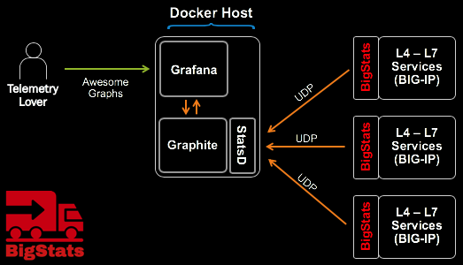
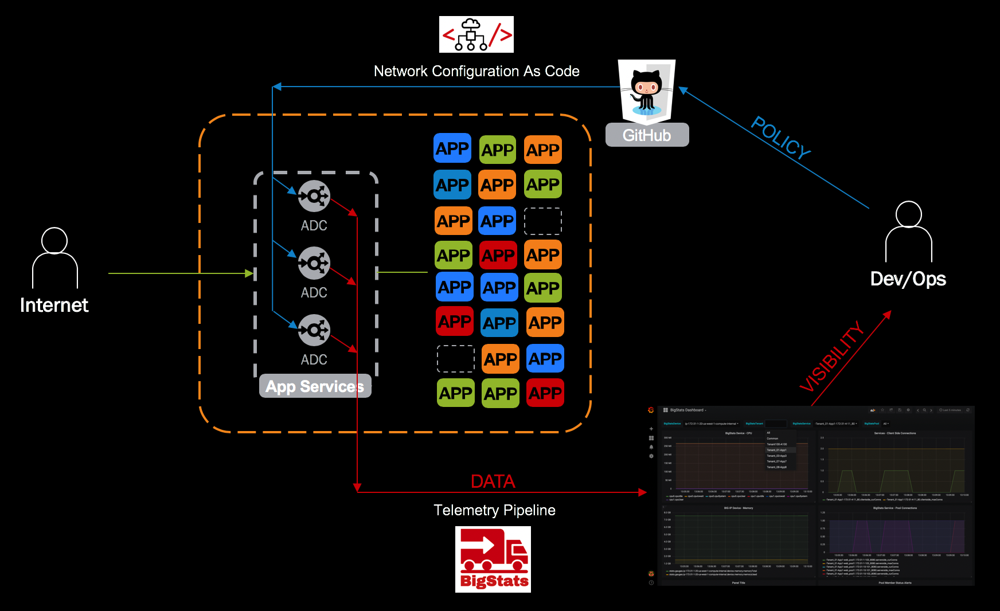

# BigStats: The BIG-IP Telemetry Exporter


[](https://travis-ci.com/f5devcentral/BigStats)

BigStats pushes BIG-IP telemetry to remote logging services/pipelines. It supports HTTP, HTTPS, StatsD, and Apache Kafka destinations.

With BigStats you can insert your valuable BIG-IP stats into your telemetry pipeline solutions, like this:



Learn more about BigStats [here](https://REDtalks.live/BigStats) (videos and stuff)

Combine BigStats with the [Github Webhook Server](https://github.com/f5devcentral/CaC-Github_Webhook_Server) for a more complete solution:



## REQUIREMENTS

BIG-IP v13, or newer.

## INSTALL

You can find BigStats installation instructions here: [DOCS/BIGSTATS_INSTALL.md](DOCS/BIGSTATS_INSTALL.md)

## CONFIGURE

Configuring BigStats is as simple as POSTing the appropriate settings to `/mgmt/shared/bigstats_settings`. It requires the following information:

* **protocol:** [poll|http|https|statsd|kafka]
* **address** ip address or resolvable domain name
* **port** destination port
* **uri** [OPTIONAL] End-point to post data to. Can be blank. Used only for http or https destinations.
* **interval** - how often, in seconds, to send the stats. Default: 10 seconds.
* **size** - how much data: small, medium, or large.
* **enabled** - enable/disable BigStats as required.
* **debug** - this will put a LOT of data into the BIG-IPs `/var/log/restnoded/restnoded.log`. Remember to turn this off when done.

You can view the full BigStats Configuration Schema here, [bigstats-schema.json](SRC/BigStats/nodejs/bigstats-schema-0.5.0.json), or you can follow the destination-specific instructions below:

Configure BigStats exporter for:

* [Poll (Stat scraper mode, no desintation)](DOCS/SETUP_POLL-MODE.md)
* [HTTP(S)](DOCS/SETUP_HTTP.md)
* [StatsD](DOCS/SETUP_STATSD.md)
* [Kafka](DOCS/SETUP_KAFKA.md)

## LEARN

**How does it work?**

Running on the F5 BIG-IP (physical or virtual), BigStats crawls the running configuration collecting statistics every 'n' seconds (see config) to build an object in memory like the following:

**Example BigStats Object:**

BigStats produces output in three sizes: Small, Medium, and Large.

* [Small](DOCS/OUTPUT-EXAMPLE-SMALL.md) - VIP connectivity stats
* [Medium](DOCS/OUTPUT-EXAMPLE-MEDIUM.md) - VIP and Pool member connectivity stats
* [Large](DOCS/OUTPUT-EXAMPLE-LARGE.md) - VIP and Pool member connectivity stats, and SSL stats 

You can find example outputs in the /DOCS directory.

Below is an example Medium output:

```json
{
        "ip-172-31-1-20-us-west-1-compute-internal": {
                "services": {
                        "Tenant_01/App1": {
                                "/Tenant_01/App3/172.31.4.11:80": {
                                        "clientside_curConns": 0,
                                        "clientside_maxConns": 0,
                                        "clientside_bitsIn": 0,
                                        "clientside_bitsOut": 0,
                                        "clientside_pktsIn": 0,
                                        "clientside_pktsOut": 0,
                                        "/Tenant_01/App1/web_pool1": [
                                                {
                                                        "172.31.10.112:80": {
                                                                "serverside_curConns": 0,
                                                                "serverside_maxConns": 0,
                                                                "serverside_bitsIn": 0,
                                                                "serverside_bitsOut": 0,
                                                                "serverside_pktsIn": 0,
                                                                "serverside_pktsOut": 0,
                                                                "monitorStatus": "down"
                                                        }
                                                },
                                                {
                                                        "172.31.10.111:80": {
                                                                "serverside_curConns": 0,
                                                                "serverside_maxConns": 0,
                                                                "serverside_bitsIn": 0,
                                                                "serverside_bitsOut": 0,
                                                                "serverside_pktsIn": 0,
                                                                "serverside_pktsOut": 0,
                                                                "monitorStatus": "down"
                                                        }
                                                },
                                                {
                                                        "172.31.10.113:80": {
                                                                "serverside_curConns": 0,
                                                                "serverside_maxConns": 0,
                                                                "serverside_bitsIn": 0,
                                                                "serverside_bitsOut": 0,
                                                                "serverside_pktsIn": 0,
                                                                "serverside_pktsOut": 0,
                                                                "monitorStatus": "down"
                                                        }
                                                },
                                                {
                                                        "172.31.10.114:80": {
                                                                "serverside_curConns": 0,
                                                                "serverside_maxConns": 0,
                                                                "serverside_bitsIn": 0,
                                                                "serverside_bitsOut": 0,
                                                                "serverside_pktsIn": 0,
                                                                "serverside_pktsOut": 0,
                                                                "monitorStatus": "down"
                                                        }
                                                }
                                        ]
                                }
                        },
                        "Common": {
                                "/Common/172.31.4.200:80": {
                                        "clientside_curConns": 0,
                                        "clientside_maxConns": 0,
                                        "clientside_bitsIn": 0,
                                        "clientside_bitsOut": 0,
                                        "clientside_pktsIn": 0,
                                        "clientside_pktsOut": 0,
                                        "/Common/noAS3_POOL": [
                                                {
                                                        "172.31.10.200:8080": {
                                                                "serverside_curConns": 0,
                                                                "serverside_maxConns": 0,
                                                                "serverside_bitsIn": 0,
                                                                "serverside_bitsOut": 0,
                                                                "serverside_pktsIn": 0,
                                                                "serverside_pktsOut": 0,
                                                                "monitorStatus": "down"
                                                        }
                                                },
                                                {
                                                        "172.31.10.201:8080": {
                                                                "serverside_curConns": 0,
                                                                "serverside_maxConns": 0,
                                                                "serverside_bitsIn": 0,
                                                                "serverside_bitsOut": 0,
                                                                "serverside_pktsIn": 0,
                                                                "serverside_pktsOut": 0,
                                                                "monitorStatus": "down"
                                                        }
                                                },
                                                {
                                                        "172.31.10.202:8080": {
                                                                "serverside_curConns": 0,
                                                                "serverside_maxConns": 0,
                                                                "serverside_bitsIn": 0,
                                                                "serverside_bitsOut": 0,
                                                                "serverside_pktsIn": 0,
                                                                "serverside_pktsOut": 0,
                                                                "monitorStatus": "down"
                                                        }
                                                }
                                        ]
                                }
                        }
                },
                "device": {
                        "memory": {
                                "memoryTotal": 8063365120,
                                "memoryUsed": 1509008040
                        },
                        "cpu0": {
                                "fiveSecAvgIdle": 99,
                                "fiveSecAvgIowait": 0,
                                "fiveSecAvgIrq": 0,
                                "fiveSecAvgNiced": 0,
                                "fiveSecAvgRatio": 1,
                                "fiveSecAvgSoftirq": 0,
                                "fiveSecAvgStolen": 0,
                                "fiveSecAvgSystem": 0,
                                "fiveSecAvgUser": 0
                        },
                        "cpu1": {
                                "fiveSecAvgIdle": 99,
                                "fiveSecAvgIowait": 0,
                                "fiveSecAvgIrq": 0,
                                "fiveSecAvgNiced": 0,
                                "fiveSecAvgRatio": 1,
                                "fiveSecAvgSoftirq": 0,
                                "fiveSecAvgStolen": 0,
                                "fiveSecAvgSystem": 0,
                                "fiveSecAvgUser": 0
                    }
                }
        }
}
```

Then, depending on the configuration, BigStats re-formats the object to match the desired destination (none/http/https/StatsD/Kafka) and sends the data.

With BigStats you can insert your valuable BIG-IP data into your telemetry pipeline solutions, like this:


## CONTRIBUTING

**Unit Tests**

Unit tests for this project have been written in [Mocha](https://mochajs.org/) with support from [Sinon.JS](https://sinonjs.org/) and [ProxyQuire](https://github.com/thlorenz/proxyquire) for mocking and stubbing.
Use `npm test` from the root directory of the project to run all unit tests.
